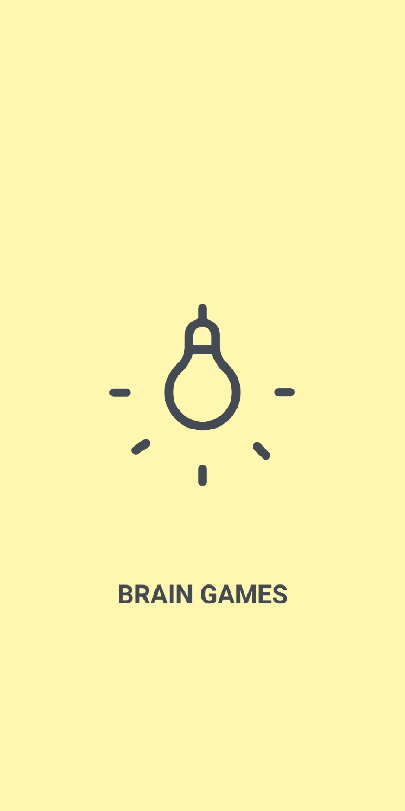
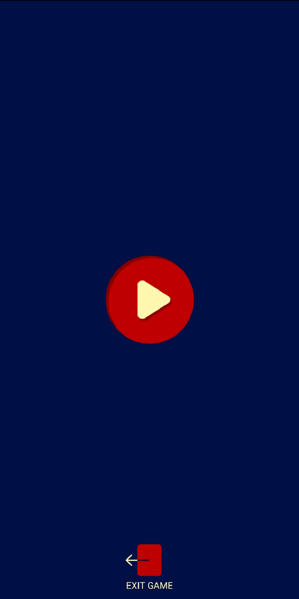
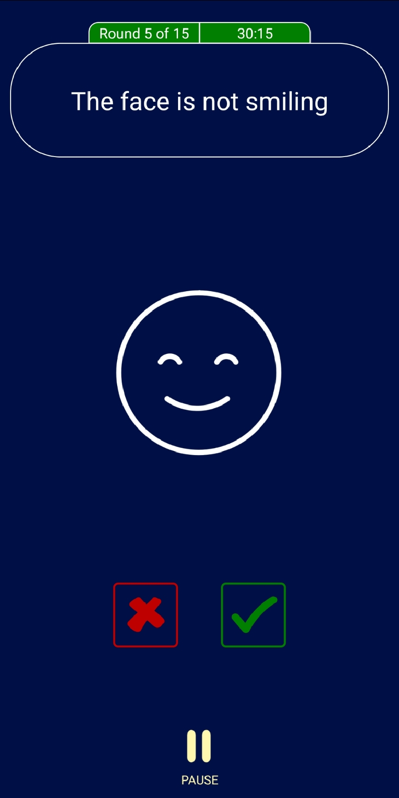
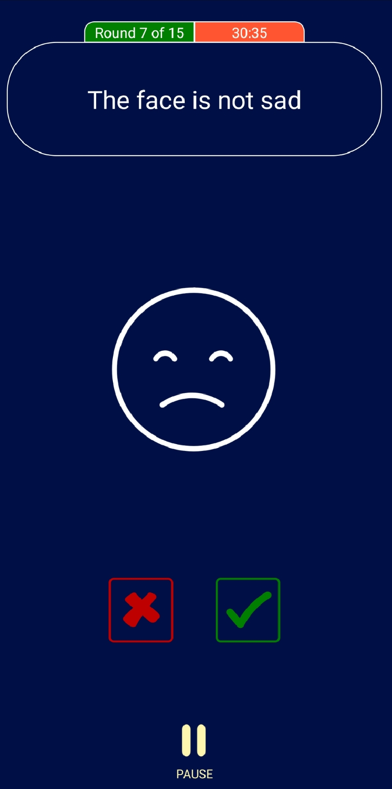

<a name="readme-top"></a>
[![linkedin][linkedin-shield]][linkedin-url]
<!-- TITLE -->
# Brain Game - Happy or Sad?

Welcome to the Brain Game - Happy or Sad! This mobile app is designed to test your comprehension skills by matching phrases with corresponding facial expressions. Are you ready to challenge your brain and have some fun?

# Screenshots
<div align="center">  
    
    
    
    
    
</div>

<!-- FEATURES -->
## Features

- Test your comprehension skills by matching phrases with happy or sad faces.
- Simple and intuitive user interface.
- 15 levels of increasing difficulty.
- Timer to challenge yourself to complete the game in under 30, 50, or 60 seconds.

<!-- DESCRIPTION -->
## How to Play
- Launch the app and start a new game.
- On each level, a phrase will be displayed along with a happy or sad face image.
- Read the phrase and determine whether it accurately describes the facial expression.
- If the phrase matches the facial expression, press the check icon. If not, press the X icon.
- Continue through all 15 levels as quickly as possible.
- Try to complete the game in under 30, 50, or 60 seconds for optimal performance.

<!-- TECH STACK -->
## Tech Stack

- [![reactnative][reactnative-shield]][reactnative-url]
- [![react][react-shield]][react-url]
- [![redux][redux-shield]][redux-url]
- [![reactnavigation][reactnavigation-shield]][reactnavigation-url]
- [![lottie][lottie-shield]][lottie-url]
- [![axios][axios-shield]][axios-url]

<!-- INSTALLATION -->
## Installation

  - Clone the repo
   ```sh
   git clone https://github.com/shervin-ghajar/brain-game.git
   ```
   - Navigate to the project directory and install NPM packages
```bash
  cd mbgame
  npm install
```

- Run the app on an iOS or Android emulator using 
```bash 
npx react-native run-ios
//or
npx react-native run-android
```
<!-- CONTACT -->
## Contact Me

#### Shervin Ghajar
- [Linkedin][linkedin-url]
- Gmail: ssghajar.work@gmail.com
<!-- LICENSE -->
## License

[MIT](LICENSE)

<p align="right">(<a href="#readme-top">back to top</a>)</p>


<!-- MARKDOWN LINKS & IMAGES -->
<!-- https://www.markdownguide.org/basic-syntax/#reference-style-links -->

[linkedin-shield]: https://img.shields.io/badge/Linkedin-0A66C2?style=for-the-badge&logo=linkedin&logoColor=white
[linkedin-url]: https://www.linkedin.com/in/shervin-ghajar-254258180/

[gmail-shield]: https://shields.io/badge/Gmail-white?logo=gmail
[gmail-url]: ssghajar.work@gmail.com

[reactnative-shield]: https://shields.io/badge/React_Native-v0.61.5-blue?logo=react
[reactnative-url]: https://reactnative.dev/

[react-shield]: https://shields.io/badge/React-v16.9.0-blue?logo=react
[react-url]: https://react.dev/

[reactnavigation-shield]: https://shields.io/badge/React_Navigation-v3.0.9-blue?logo=react-navigation
[reactnavigation-url]: https://reactnavigation.org/

[redux-shield]: https://shields.io/badge/Redux-v4.0.1-blue?logo=redux
[redux-url]: https://redux.js.org/


[lottie-shield]: https://shields.io/badge/lottie--react--native-v3.3.2-blue?logo=lottie
[lottie-url]: https://www.npmjs.com/package/lottie-react-native

[axios-shield]: https://shields.io/badge/Axios-v0.19.2-blue?logo=axios
[axios-url]: https://www.npmjs.com/package/axios

[product-screenshot]: screenshots/intro.jpg


